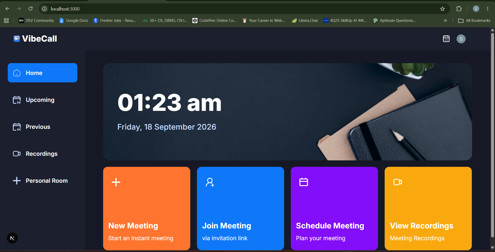
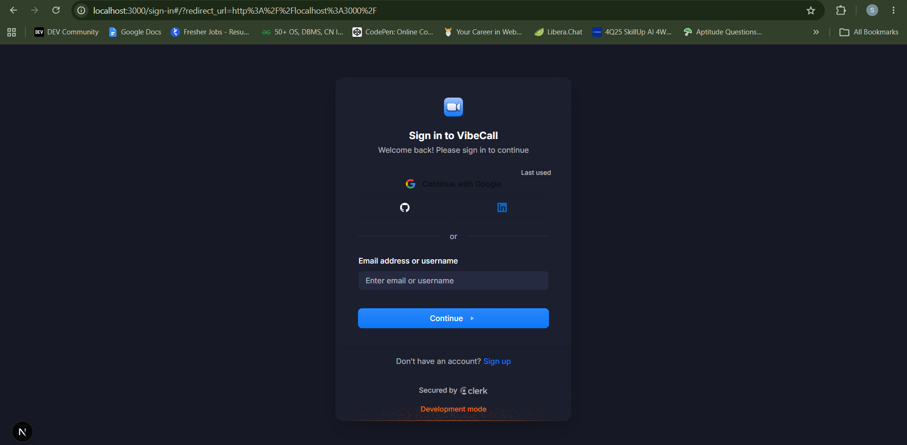
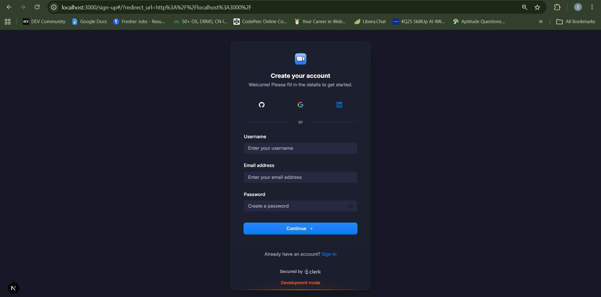
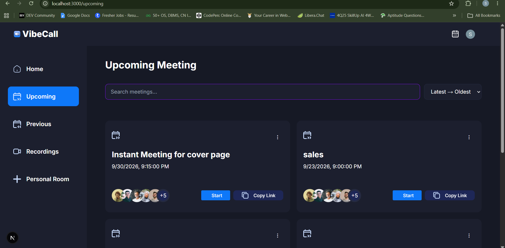
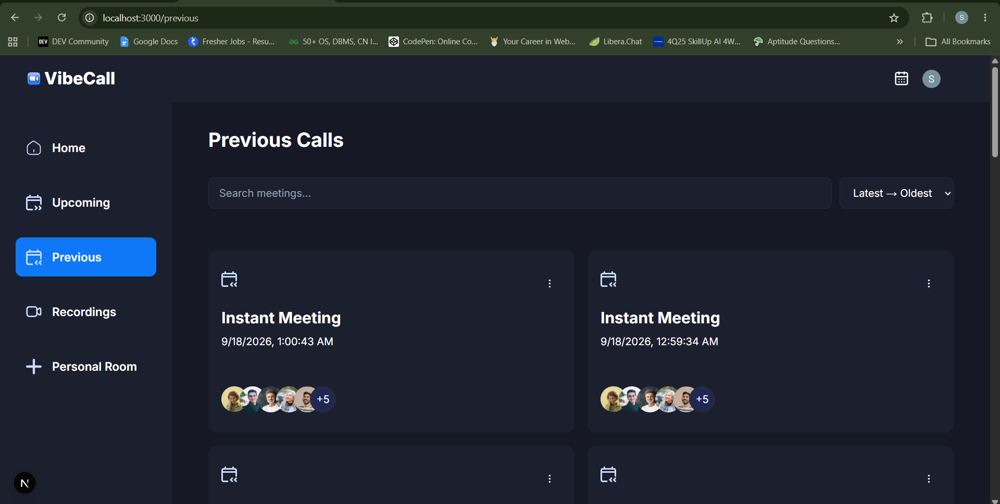
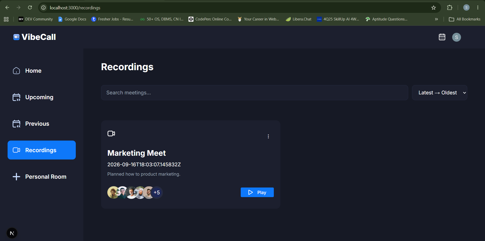
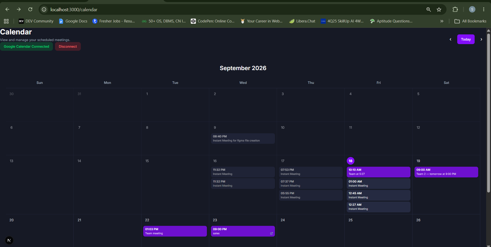
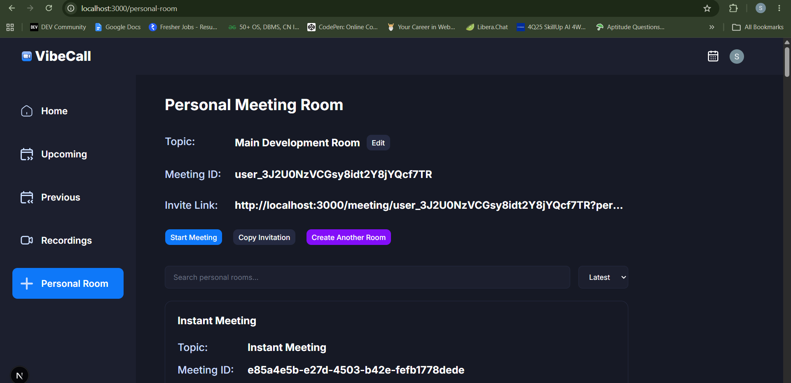

# VibeCall

> A full-stack real-time video conferencing platform built with Next.js, Clerk, and Stream.

VibeCall is a modern video meeting application that allows users to securely create, schedule, join, and manage online meetings. It includes real-time video communication, screen sharing, recordings, participant management, meeting chat, host controls, and passcode-protected meetings.

The project was built to explore production-style video conferencing concepts including authentication, real-time communication, meeting state, permissions, and interactive UI.

## Features

* **User Authentication** — Secure sign-up and sign-in with Clerk
* **Create Meetings** — Start instant meetings with unique meeting rooms
* **Schedule Meetings** — Schedule meetings for a future date and time
* **Join Meetings** — Join meetings through unique meeting links
* **Personal Room** — Dedicated personal meeting room for each user
* **Meeting Passcode** — Protect meetings with a passcode
* **Host Controls** — Meeting hosts can manage and end meetings
* **Waiting Room** — Participants wait for the host before entering the meeting
* **Real-Time Video & Audio** — Powered by Stream Video
* **Screen Sharing** — Share your screen during meetings
* **Mute / Camera Controls** — Manage microphone and camera during calls
* **Meeting Chat** — Real-time text chat inside meetings
* **Participants Panel** — View participants currently in the meeting
* **Participant Count** — Display the current number of participants
* **Multiple Layouts** — Grid, speaker-left, and speaker-right layouts
* **Meeting Recordings** — Access recorded meetings
* **Call Statistics** — View real-time call statistics
* **Meeting Sharing** — Share or copy the current meeting link
* **End Call for Everyone** — Meeting owner can terminate the meeting for all participants
* **Responsive UI** — Designed for different screen sizes

## Tech Stack

### Frontend

* Next.js
* React
* TypeScript
* Tailwind CSS
* shadcn/ui
* Lucide React

### Authentication

* Clerk

### Real-Time Communication

* Stream Video SDK
* Stream Chat SDK

### Backend / Server

* Next.js Server Actions
* Stream Node SDK

### Development Tools

* ESLint
* Git
* GitHub

## Screenshots

### Home



### Authentication

<table>
  <tr>
    <td width="50%">
      
    </td>
    <td width="50%">
      
    </td>
  </tr>
</table>

### Meeting Management

<table>
  <tr>
    <td width="50%">
      
    </td>
    <td width="50%">
      
    </td>
  </tr>
  <tr>
    <td width="50%">
      
    </td>
    <td width="50%">
      
    </td>
  </tr>
</table>

### Personal Room



## Application Flow

```text
User
 │
 ▼
Clerk Authentication
 │
 ▼
VibeCall Dashboard
 │
 ├── Create Meeting
 │      └── Meeting Room
 │
 ├── Schedule Meeting
 │      └── Upcoming Meetings
 │
 ├── Personal Room
 │      └── Meeting Room
 │
 └── Join Meeting
        │
        ▼
   Passcode Verification
        │
        ▼
    Meeting Lobby
        │
        ▼
    Video Meeting
        │
        ├── Video / Audio
        ├── Screen Share
        ├── Participants
        ├── Meeting Chat
        ├── Recording
        ├── Call Statistics
        └── Host Controls
```

## Project Structure

```text
vibeCall/
├── actions/
│   └── stream.actions.ts
│
├── app/
│   ├── (auth)/
│   ├── (root)/
│   ├── api/
│   ├── globals.css
│   └── layout.tsx
│
├── components/
│   ├── MeetingChat.tsx
│   ├── MeetingLobby.tsx
│   ├── MeetingRoom.tsx
│   ├── MeetingSetup.tsx
│   ├── MeetingCard.tsx
│   ├── EndCallButton.tsx
│   └── ...
│
├── hooks/
│   ├── useGetCallById.ts
│   └── useGetCalls.ts
│
├── providers/
│   └── StreamClientProvider.tsx
│
├── lib/
│   └── utils.ts
│
├── public/
├── proxy.ts
├── package.json
└── README.md
```

## Getting Started

### 1. Clone the repository

```bash
git clone https://github.com/shrutikotgire0129/vibeCall.git
```

### 2. Navigate to the project

```bash
cd vibeCall
```

### 3. Install dependencies

```bash
npm install
```

### 4. Configure environment variables

Create a `.env.local` file in the root directory:

```env
NEXT_PUBLIC_CLERK_PUBLISHABLE_KEY=
CLERK_SECRET_KEY=

NEXT_PUBLIC_STREAM_API_KEY=
STREAM_SECRET_KEY=
```

Add the appropriate values from your Clerk and Stream dashboards.

> Never commit `.env.local` or other files containing secret credentials to GitHub.

### 5. Start the development server

```bash
npm run dev
```

Open `http://localhost:3000` in your browser.

## Production Build

Create a production build:

```bash
npm run build
```

Then start the production server:

```bash
npm start
```

## Environment & Security

VibeCall keeps sensitive credentials outside the source code using environment variables.

The repository's `.gitignore` excludes environment files such as:

```text
.env
.env.local
.env.*
```

Server-side Stream credentials are handled through Next.js server-side code rather than being exposed directly to the browser.

## What I Learned

Building VibeCall provided hands-on experience with:

* Building a full-stack application with Next.js
* Implementing authentication with Clerk
* Integrating real-time video infrastructure
* Working with real-time messaging
* Managing asynchronous meeting state
* Handling host and participant permissions
* Implementing protected meeting flows
* Working with Next.js